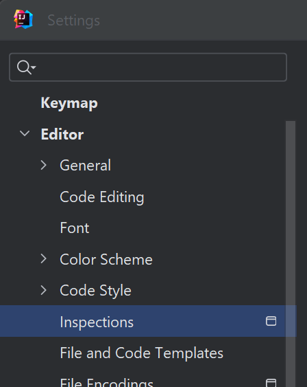
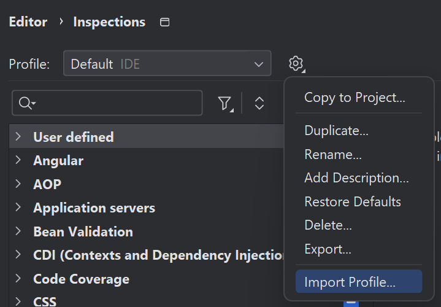
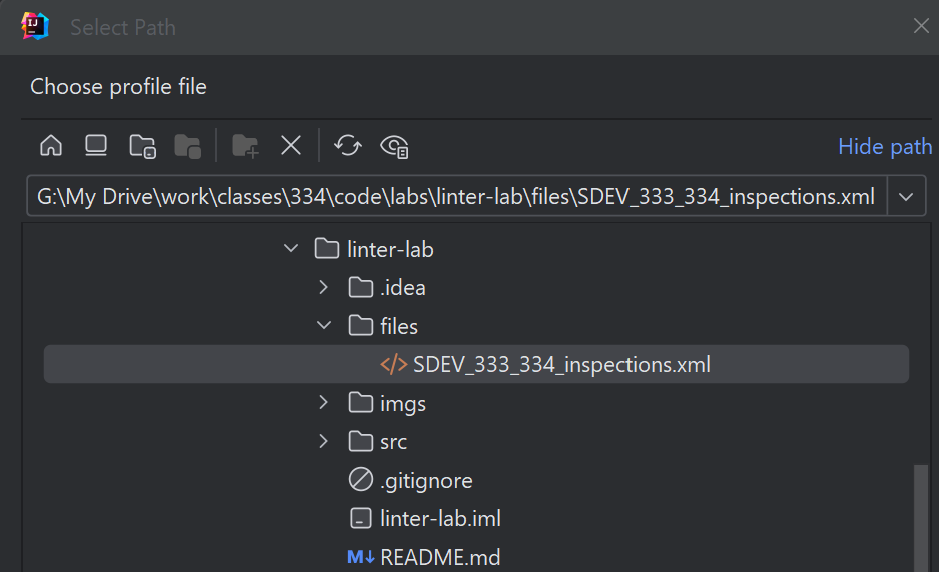
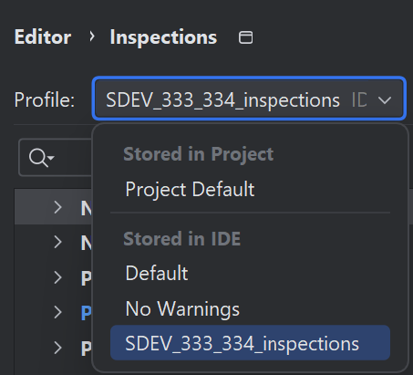
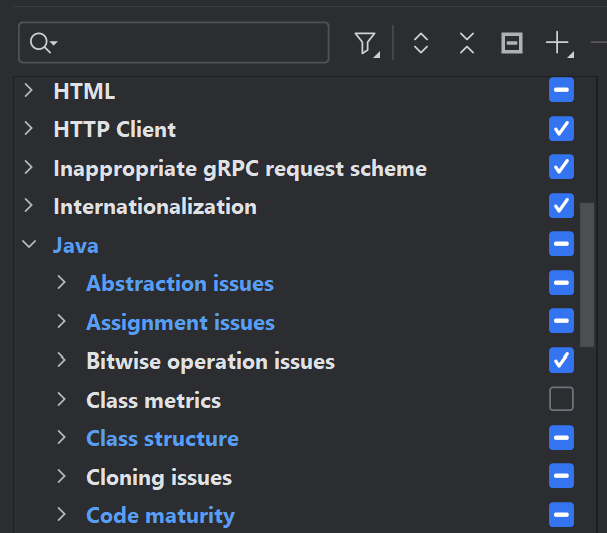
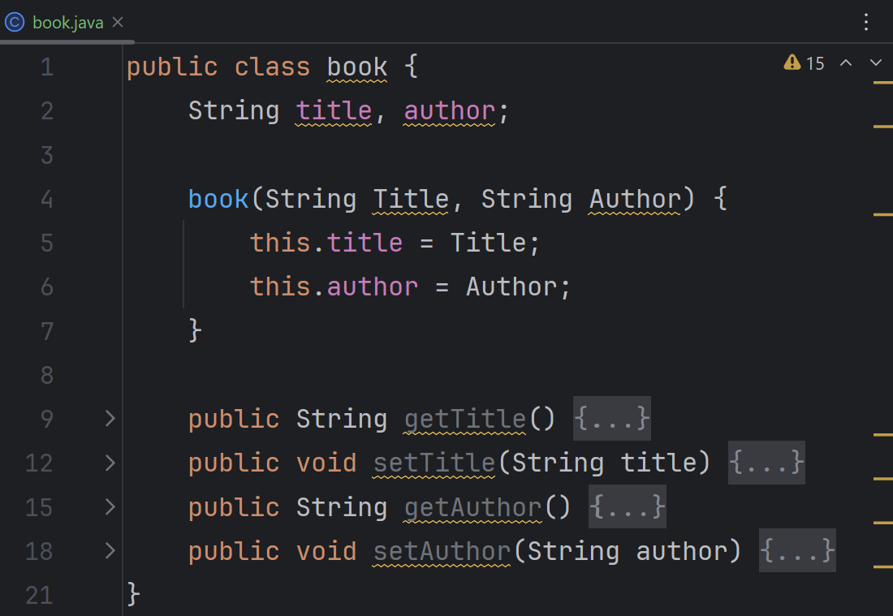
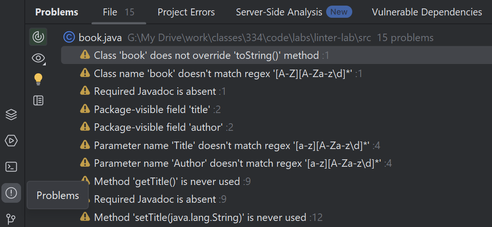
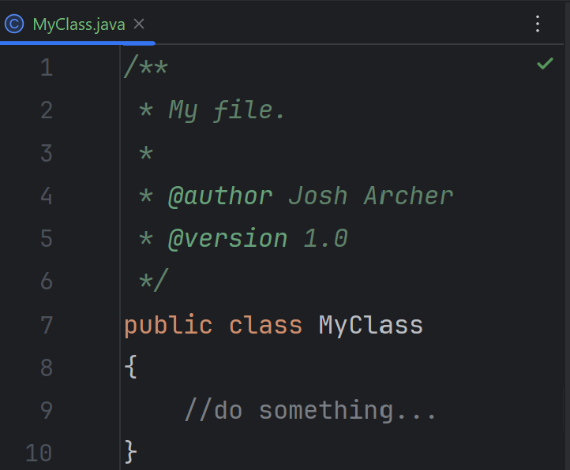

# Overview
In this lab exercise, you will learn how to identify and fix common coding style issues in a Java project by using 
the IntelliJ built-in linter. We will focus on correcting naming conventions, adding missing Javadoc 
comments, and addressing other linter warnings in a provided Java codebase. The ultimate goal is to improve 
code readability and maintainability by adhering to best practices in Java development.

## Prerequisites
- IntelliJ IDEA installed on your computer.
- Basic understanding of Java programming.
- Familiarity with the concept of linting in software development.

## Setup
1. Clone the Lab Repository: Start by cloning the provided lab repository to your local machine, using the link 
   Github classroom link provided by your instructor. This repository contains the Java code with intentional 
   linter issues. 
2. Open the Project in IntelliJ
3. Import the XML Configuration MyClass:
    - Download the provided SDEV_333_334_inspections.xml file from the `files` folder in the project files.
    - In IntelliJ, go to MyClass > Settings > Editor > Inspections.
   
      
      
    - Choose the import option from the gear icon.
   
      
   
    - Select the downloaded XML file and click OK.
   
      

    - Verify that the profile is selected from the drop-down menu.

      

    - Verify that there are changes to the Java inspections listed (in blue).  
      
      

## Lab Instructions
1. **Explore the Code:** Take a moment to explore the library.java and book.java files in the project. Notice the 
   intentional issues that conflict with Java best practices.
2. **Run the Linter:**
    - This happens automatically.
3. **Identify Issues:** 
    - The linter will highlight various issues in the code, such as naming conventions, missing 
      Javadoc comments, and more.   
   
      

     - You can hover over code segments that are highlighted and see a message from the Linter describing the problem.
     - You can also view the "Problems" tab in IntelliJ, which will list all identified issues.

       

4. **Fix Linter Issues:**
    - **Naming Conventions:** Rename classes, methods, and variables to follow Java naming conventions (e.g., 
      classes should start with uppercase letters).
    - **Add Javadoc Comments:** Write meaningful Javadoc comments for all classes, methods, and constructors.
    - **Encapsulation:** Modify the book class to use private fields with public getter (and optionally setter) methods.
    - Follow the linter's suggestions to address all highlighted issues.
5. Re-run the Linter: This will happen automatically as you make changes to the code. Repeat the fixing process 
   as necessary. When you have fixed all problems in a file, you should get a green check mark
   at the top-right of the editor for that particular file.

   

## Submission

Once you have fixed all linter issues for all files, commit and push your changes to your repository. Your instructor will 
automatically be able to see your changes using the Github Classroom tool.

## Grading Criteria
- **Correctness**: No linter warnings or errors remain in the code.
- **Documentation**: All classes, methods, and fields have appropriate Javadoc comments.
- **Code Style**: Code follows Java best practices for naming conventions and structure.

## Additional Resources
- <a href="https://www.jetbrains.com/help/idea/code-inspection.html">IntelliJ IDEA Code Inspection</a>
- <a href="https://www.oracle.com/technetwork/java/codeconventions-150003.pdf">Java Style Guide</a>